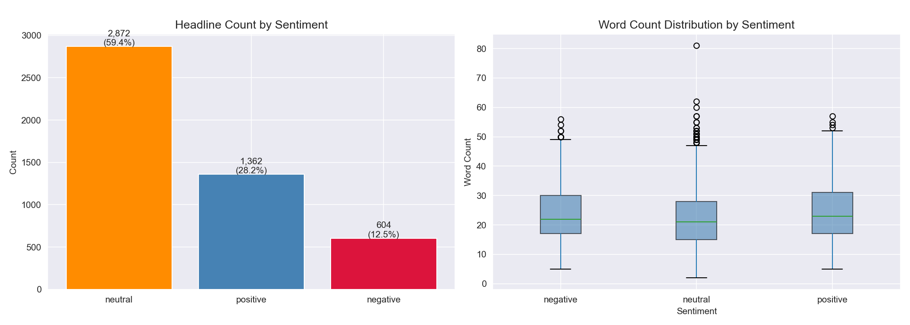
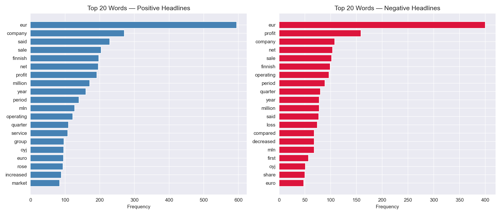
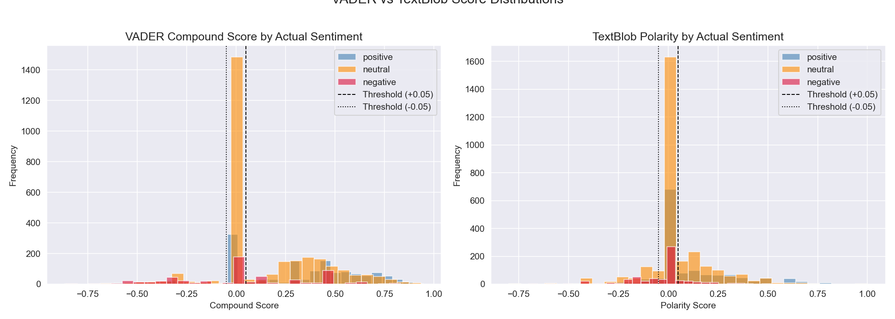
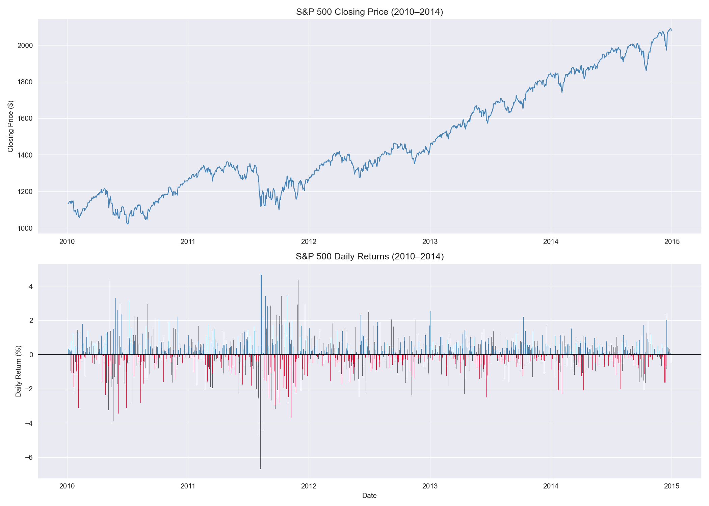
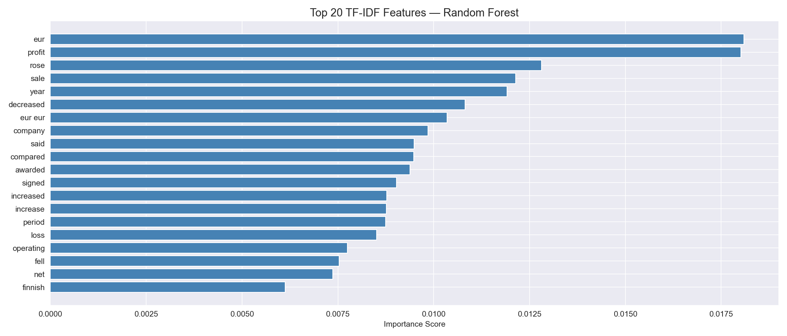
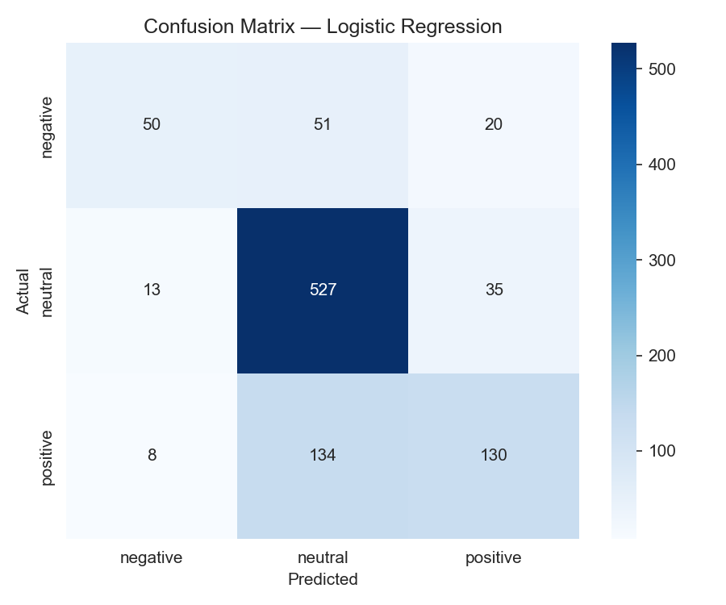
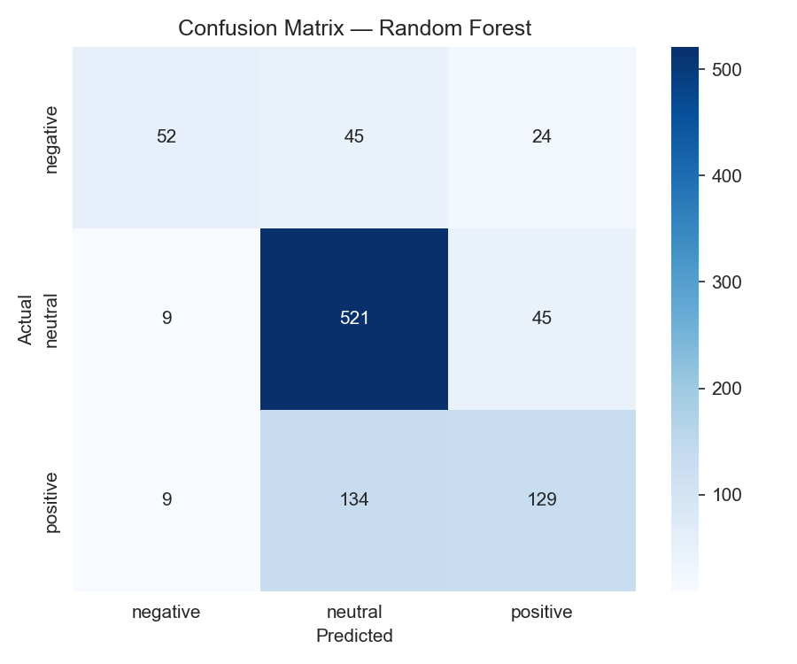

# Stock Market Sentiment Analysis — Financial News Headlines

A Python and NLP analysis of 4,838 financial news headlines, comparing rule-based sentiment analyzers (VADER and TextBlob) against machine learning classifiers trained on TF-IDF features, with S&P 500 market context for the analysis period.

---

## Problem Statement
Financial markets are driven not only by fundamentals but by sentiment — the collective mood of investors, analysts, and media. This project quantifies sentiment in financial news headlines using NLP techniques, comparing rule-based and machine learning approaches to answer:
- How accurately can general-purpose NLP tools classify financial sentiment?
- Can machine learning significantly outperform rule-based analyzers on domain-specific financial text?
- Which words and phrases are most predictive of financial sentiment?

---

## Dataset
- **Source:** [Kaggle — Financial News Sentiment Dataset](https://www.kaggle.com/datasets/ankurzing/sentiment-analysis-for-financial-news)
- **Size:** 4,838 headlines after deduplication
- **Classes:** Positive (28.17%), Neutral (59.51%), Negative (12.48%)
- **Origin:** European financial news (Finnish companies, EUR-denominated reporting)

---

## Tools & Libraries
- Python 3.x
- Pandas, NumPy
- NLTK (VADER, tokenization, stopwords, lemmatization)
- TextBlob
- Scikit-learn (TF-IDF, Logistic Regression, Random Forest)
- Matplotlib, Seaborn
- yfinance

---

## Project Workflow
1. Data loading and cleaning — deduplication, headline length feature engineering
2. Exploratory analysis — sentiment distribution, word count patterns, top words by sentiment class
3. Rule-based sentiment analysis — VADER and TextBlob scoring and classification with agreement rate evaluation
4. S&P 500 market context — price and daily return visualization for the analysis period (2010–2014)
5. Machine learning classification — TF-IDF vectorization, Logistic Regression and Random Forest with 5-fold cross-validation
6. Feature importance — top predictive TF-IDF words and bigrams

---

## NLP Techniques Demonstrated
- VADER (Valence Aware Dictionary and sEntiment Reasoner) rule-based sentiment scoring
- TextBlob polarity and subjectivity scoring
- Text preprocessing — lowercasing, punctuation removal, stopword filtering, lemmatization
- TF-IDF vectorization with unigrams and bigrams
- Multi-class classification (negative / neutral / positive)
- Cross-validation accuracy evaluation

---

## Key Findings
- Dataset contains **4,838 financial headlines** with a heavy neutral skew (59.51%) — consistent with measured, factual financial journalism; only 12.48% of headlines are negative
- **VADER achieved 54.32% agreement** with actual labels and **TextBlob 50.93%** — both barely above a naive baseline, confirming that general-purpose NLP tools are insufficient for domain-specific financial text
- **VADER systematically under-detects negative sentiment** — average compound score for negative headlines (0.029) is nearly indistinguishable from neutral (0.151), a dangerous blind spot for risk management applications
- **Both ML models achieved 73% accuracy** — a 19–22 percentage point improvement over rule-based analyzers — validating the case for supervised learning on domain-specific financial NLP
- **Random Forest showed tighter cross-validation variance** (+/- 0.007 vs +/- 0.014) making it the more stable model for production deployment despite identical test accuracy
- **"EUR," "profit," and "rose"** were the top predictive TF-IDF features, reflecting the dataset's European financial news origin and confirming that financial sentiment vocabulary is highly domain-specific
- Both models struggled most with **negative headline recall** (0.41–0.43) — the most costly misclassification in real trading and risk management contexts — motivating FinBERT as the next step
- The **S&P 500 delivered 83.62% total return** over 2010–2014 with 56% positive return days — broadly consistent with the dataset's positive-skewed news sentiment distribution

---

## Visualizations

### Sentiment Distribution


### Top Words by Sentiment


### VADER vs TextBlob Score Distributions


### S&P 500 Price & Returns


### ROC Curve Comparison


### Feature Importance


### Confusion Matrices



---

## Limitations & Next Steps
- VADER and TextBlob are general-purpose analyzers — FinBERT would perform significantly better on financial text
- Dataset originates primarily from European financial news — may not generalize to U.S. market sentiment without retraining
- TF-IDF does not capture word order or context — transformer models (BERT, FinBERT) would better handle negation and nuance
- Class imbalance (59.51% neutral) suppresses performance on minority positive and negative classes
- Future work: FinBERT implementation, class weighting, real-time news ingestion via financial news API, sentiment-based trading signal construction

---

## How to Run This Project
1. Clone the repository
2. Download `all-data.csv` from  [Kaggle](https://www.kaggle.com/datasets/ankurzing/sentiment-analysis-for-financial-news) and place it in the project root folder
3. Install Python dependencies: `pip install pandas numpy matplotlib seaborn nltk textblob scikit-learn yfinance`
4. Download NLTK resources — run once in Python:
```python
   import nltk
   nltk.download('vader_lexicon')
   nltk.download('stopwords')
   nltk.download('punkt')
   nltk.download('punkt_tab')
   nltk.download('wordnet')
```
5. Open `sentiment_analysis.ipynb` in Jupyter or VS Code
6. Run all cells top to bottom

---

## Repository Structure


---

## Author
**Mihrimah Qozat**
[LinkedIn](https://linkedin.com/in/mihrimah-qozat) |
[GitHub](https://github.com/mihrimahqozat)
